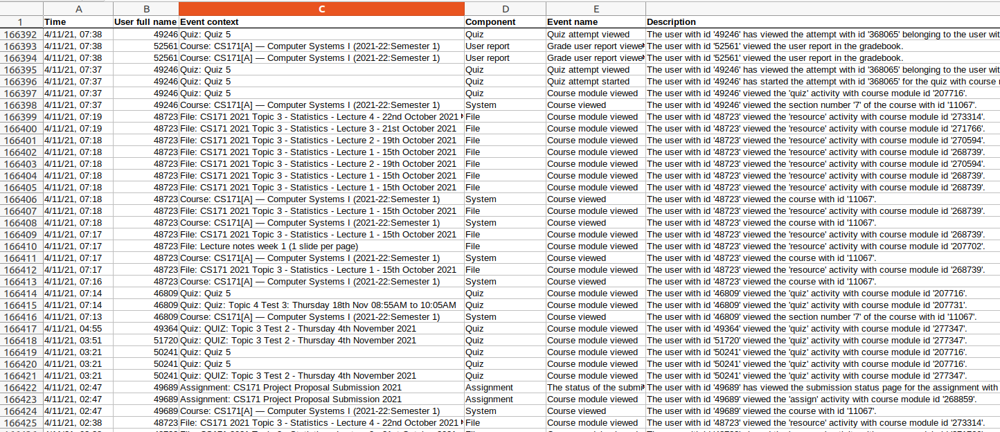

# Title: Development of an engagement score for student interaction on Moodle.

# Description
Moodle is used extensively in Maynooth University (and thousands of other educational facilities around the world). While Moodle offers teachers and lecturers many really useful tools for managing the administrative side of teaching (assessments, marking, grading, and so) Moodle is less useful when it comes to automated ways of assess how students are engaging with a particular module. This project will build software capable of analysis Moodle log files in order to test out different possible 'engagement scores' or 'engagement measurements'. These quantitative values will be a combination of all of the interactions a student has had with a particular module on Moodle. This project requires a student to have a keen interest in data analytics, working with large log files and developing/testing innovative ways to measure student engagement on Moodle.

## Core project Idea
What do we mean by student interaction or student engagement on Moodle? Today, the majority of interactions between teacher/lecturer and students in a class is via Moodle. All content for a module is placed on Moodle. Students take quizzes on Moodle. Assignments are posted there. Assignment submissions are uploaded to Moodle. Students can access their grades on Moodle. There are also opportunities for discussion and communication between students and the entire class via the discussion forums. For teachers/lecturers using Moodle for small class sizes Moodle provides administration of the module/class and the teacher/lecturer can assertain themselves how engaged or interactive the students are in the class. Engagement or interactive here means: reading the lecture notes, accessing the material on Moodle, downloading files from Moodle, clicking on links, interacting using the forums and so on. However, as class sizes become large (a large class can be considered anything more than 30 or 40 students) it becomes really difficult (actually impossible) for a teacher/lecturer to keep track of student interaction and engagement. Automated tool support is required.

The software developed in this project will automatically read a Moodle Log file and then produce a precomputed engagement or interaction score for every student in the class (represented in the log file). Several different engagement or interaction scores will need to be developed, computed, tested and compared.

The project will supply several annonymised Moodle log files for analysis.

# Reference or URL of supporting material
This project will require the student to write their own software code from scratch.

The image below shows a screenshot of an annonymised Moodle Log file. Some Moodle log files, depending on the module or course, can have over 100,000 log file entries for one Semester.

# Languages and areas of interest

Ideally, Python. The emphasis here is on the development of the 'engagement scores' or 'engagement measurements'. This project will not include a web-application or web-interface.

The student will need to have an interest in analysis of the log files on Moodle. Certainly an interest in statistical analysis, visualisation, and the investigative research process are useful but not essential.
