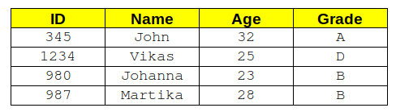
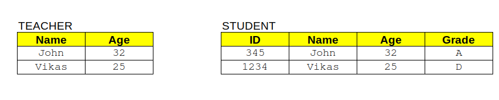

# Title: Automated SQL query checking

# Description
Even a very simple SQL query can be written in a number of different ways and return the correct answer. This makes the manual correction of SQL-based examinations or assessment very time consuming. This project will develop a software tool to allow a teacher to automate the process of correcting SQL-based examination submissions from students. 

## Core project Idea

Consider the following table below called Table1. Suppose a student is asked to write an SQL query to return all of the names of students in Table1 who have an 'age' greater than 24.

There are many different ways this could be written (if we exclude crazy ways). Here are a few. Let's ignore the issue of whether we should have mixed case, lowercase or uppercase for the table column names.
* `Select * from Table1 where (age > 24)`
* `Select Name from Table1 where (age > 24)`
* `Select Name from Table1 where age > 24`
* `Select Name from Table1 where (age > 24) order by Name desc;`
* `Select Name from Table1 where (age > 24) order by Name;`
* `Select Name, Age from Table1 where (age > 24) order by age desc`
* and many many more

So, if this query is the answer to a question in a lab assessment or exam then there are many many ways to write the same simple SQL query. Imagine what this is like when we consider more complex queries.

So **how do we automatically check if a given SQL query is correct** if there are so many options in how the query is written? Straightforward string comparision (regardless of how tricky the regular expressions used are) will not work. Comparing the provided answer query against a list of known correct queries (for the same question) is also likely to fail as it is impossible to create a list which captures every valid query expression for any arbitrary question. Of course the teacher or examiner could impose rigorous requirements on how the SQL query is written but yet again this only generally works for simple queries. When you start considering subqueries, joins, inserts, deletes, and so on the task becomes very complicated.

The only way to approach this problem is as follows.
* The teacher creates the set of questions and then a query which returns the correct answer for each question.
* The student then takes the assessment and provides their answers to each of the questions on the exam. Each question on the exam must be answers with an SQL query only. No open text or otherwise is allowed.
* To calculate the score for the student, each SQL query as an answer is executed in the database and the output recordset is compared against the output of the known correct answer.
* If the two recordsets intersect (think Venn Diagram intersection) then the answer is correct!

### An example situation
Suppose a question in an SQL exam is as follows:

Consider the table above called Table1. Suppose a student is asked to write an SQL query to return all of the names of students in Table1 who have an 'age' greater than 24.

Correct answer (used by the teacher) `Select name,age from Table1 where (age > 24)`

Student supplied answer (provided as the solution) `Select * from Table1 where age > 24 order by name`.

A string comparison of the two SQL statements will yield no match (if we exclude some really quirky regular expressions).

However, if we consider the ResultSet returned for each query.

Comparing the ResultsSet we can see that the Name and Age columns are the same, the number of rows returned is the same (regardless of any ordering). Therefore, these two queries return a valid answer. We could argue about the semantics of whether this is a 'correct answer' as the student is only asked for name in the question. But that's for another day.

### The software

The developed software should:

* Allow the teacher create the set of questions and then supply the answers for each question as SQL statements (multiple possible).
* Retrieve a plain text file containing the student answers to each of the questions on the exam. Each question on the exam must be answered with an SQL query only. No open text or otherwise is allowed.
* The software then calculates score for the student, each SQL query as an answer is executed in the database and the output recordset is compared against the output of the known correct answer.
* A new file is output containing, where appropriate, the correct answer for questions that were incorrect for the student.

In the design phase a rigorous approproach to determining if two SQL statements return the same answer (acceptable for the examination or assessment) must be carried out.

The target database is PostgreSQL.

# Reference or URL of supporting material
This project will require the student to write their own software code from scratch.

# Languages and areas of interest

Ideally, Python as I want to use this software in my assessment (correcting assessment in future years).

Interest in SQL, databases, teaching and learning and software development is necessary.
