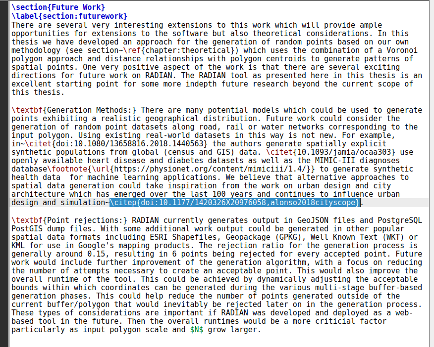
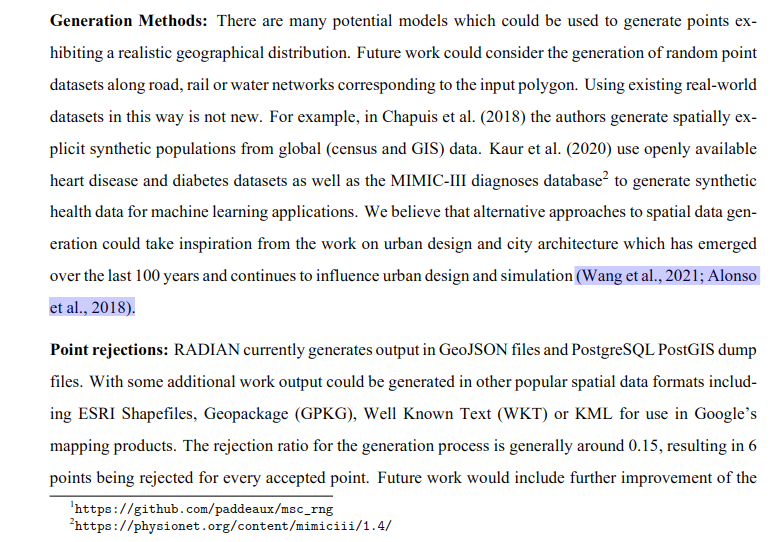
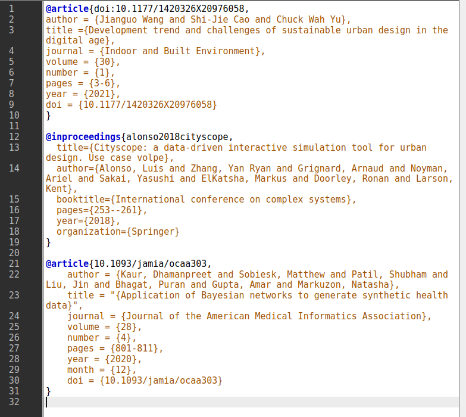

# Title: A statistics generator for LaTeX and BibTeX.

# Description
LaTeX is one of the most widely used packages for the production of scientific documents, reports and other outputs. Once you use LaTeX for things like typsetting of mathematical formulas then you'll never use a WYSIWYG editor again. It produces very high quality output, it is extremely stable, and handles complex documents easily no matter how large they are. One of the great strengths of LaTeX is its cross-referencing capabilities, its automatic numbering and generation of lists of contents, figures and tables, indexes, glossaries, and bibliographies. It is multilingual with language-specific features, and it is able to use PostScript and PDF features. LaTeX uses style files extensively called classes and packages , making it easy to design and to modify the appearance of the whole document and all of its details.

BibTeX on the other hand is used by LaTeX to manage bibliographies or references in documents. This, for me, is my favourite feature of using LaTeX. You simply put all of the references you need into a `.bib` BibTeX file and then reference or link them to your main document `.tex` LaTeX file.

The key to remember is that you don't need fancy tools to work with LaTeX. Once it is installed on your system all you need is a text editor. And now with online cloud-based systems like Overleaf all you need is your web-browser to write your latex.

This project looks to develop a software tool which can calculate some statistics or generate some visualisations about the use of BibTeX in a LaTeX document or documents. Essentially, the software tries to help the author(s) of the document understand a little more about the citations they have in their document, any patterns or repitition, or even omissions. There is very poor tool support for this type of functionality. This is really surprising given how popular LaTeX is among the global scientific community.

## Core project Idea
Suppose you have the following snippet of a LaTeX document. It is from an MSc thesis. The document is written in LaTeX. Take note of the `\citet` and `\citep` commands in the text. Notice inside the curly braces you have some string identifiers. These link to the connected BibTeX file. `\citet` means that LaTeX will format this citation as *in text* whereas `\citep` means that LaTeX will format this citation as *in parenthesis*. You can notice that in this piece of LaTeX alone there are a lot of `\citet` and `\citep` used.

The screenshot below shows the PDF rendered or produced by this LaTeX markup. We've highlighted in purple the `\citep` used in the LaTeX example above.

The corresponding BibTeX file is shown in the screenshot below. Note line 1, line 12, line 22 where the BibTeX identifiers are defined and you will be able to link these to the original LaTeX above. BibTeX has its own syntax.

The **core idea** for this software is as follows:
* Read in a set of LaTeX documents and their associated or connected BibTeX documents as shown in this example.
* Extract all citations in the LaTeX (as we have seen the `citep, citet` and so on)
* Using the BibTeX file(s) consider the types of these citations (such as journal articles (line 1 and line 21 of the BibTeX screenshot), conference proceedings (line 12 of the BibTeX screenshot)), and so on.
* Some ideas for functionality (which will be discussed in depth):
** Could we draw a visualisation of the location of citations in the document? This could be generated automatically by looking at the structure of the LaTeX document (section, subsection, etc....) and where the citations are.
** How close are the citations in the text?
** Compute generaal statistics about the citations in a LaTeX document (or set of documents)
** Allow for the merging (without duplication) of two BibTeX documents or file
** and other ideas as they arise.

# Reference or URL of supporting material
This project will require the student to write their own software code from scratch.
Just Google for LaTeX, BibTeX, citations and so on. Look at Overleaf.

# Languages and areas of interest

Ideally, Python as I want to use this software. I'm very flexible. All offers wil be discussed.

Previous experience of LaTeX and BibTeX is an advantage but not essential.

Students must be willing to learn how to write LaTeX, use BibTeX and be good at complicated text parsing and processing.

This software will be released to the world as open source software via GitHub as it is likely to be very useful to lots of people.
